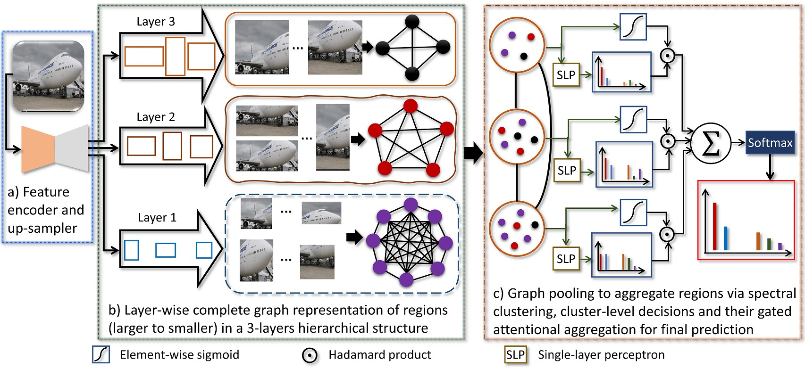

## An Attention-driven Hierarchical Multi-scale Representation for Visual Recognition
**Zachary Wharton, Ardhendu Behera and Asish Bera**<br>
**Department of Computer Science, Edge Hill University, United Kingdom**

### Abstract
Convolutional Neural Networks (CNNs) have revolutionized the understanding of visual content. This is mainly due to their ability to break down an image into smaller pieces, extract multi-scale localized features and compose them to construct highly expressive representations for decision making. However, the convolution operation is unable to capture long-range dependencies such as arbitrary relations between pixels since it operates on a fixed-size window. Therefore, it may not be suitable for discriminating subtle changes (e.g. fine-grained visual recognition). To this end, our proposed method captures the high-level long-range dependencies by exploring Graph Convolutional Networks (GCNs), which aggregate information by establishing relationships among multiscale hierarchical regions. These regions consist of smaller (closer look) to larger (far look), and the dependency between regions is modeled by an innovative attention-driven message propagation, guided by the graph structure to emphasize the neighborhoods of a given region. Our approach is simple yet extremely effective in solving fine-grained and generic visual classification problems. It outperforms the state-of-the-art with a significant margin on three and is very competitive on another two datasets.

### Attention-driven Hierarchical Representation
To discriminate subtle variations in visual features, the hierarchical connection between regions should be considered so that the larger regions (_see from far_) pay more attention to the high-level shape and appearance, and the smaller ones (_closer look_) concentrate on detailed texture and parts information to capture subtle variations. As a result, it can provide a rich representation by jointly learning meaningful complementary information from multi-scale hierarchical regions that apply to both FGVC (_coarse-to-fine_) and generic visual classification (_fine-to-coarse_). We achieve this by a novel _multi-scale hierarchical representation learning_ to boost the recognition accuracy by jointly integrating local (within a region) and non-local (between regions) information to capture long-range dependencies by exploring the graph structure to propagate information between regions within a layer, as well as between layers in the hierarchical structure.


**Our Model Architecture: a) CNN backbone as an encoder followed by an up-sampler to increase spatial resolution. b) Layer-wise graph representation using multi-scale regions to capture long-range dependencies using GCN’s aggregation scheme in which the feature of a node is computed by recursively aggregating and transforming features from its neighboring nodes. c) Graph coarsening by grouping the similar nodes using spectral clustering, followed by cluster-level predictions and their gated attentional aggregation for making a final decision.**

### Paper and Supplementary Information
Extended version of the accepted paper in [ArXiv](https://arxiv.org/pdf/2110.12178).

[Supplementary Document](BMVC2021-Supplementary.pdf)

### Bibtex
```markdown
@inproceedings{wharton2021attention,
  title={An Attention-driven Hierarchical Multi-scale Representation for Visual Recognition},
  author={ Wharton, Zachary and Behera, Ardhendu and Bera, Asish},
  booktitle={The 32nd British Machine Vision Conference 2021 (BMVC 2021)},
  year={2021},
  organization={BMVA}
}
```

### Acknowledgements

This research was supported by the UKIERI (CHARM) under grant DST UKIERI-2018-19-10. The GPU is kindly donated by the NVIDIA Corporation.
